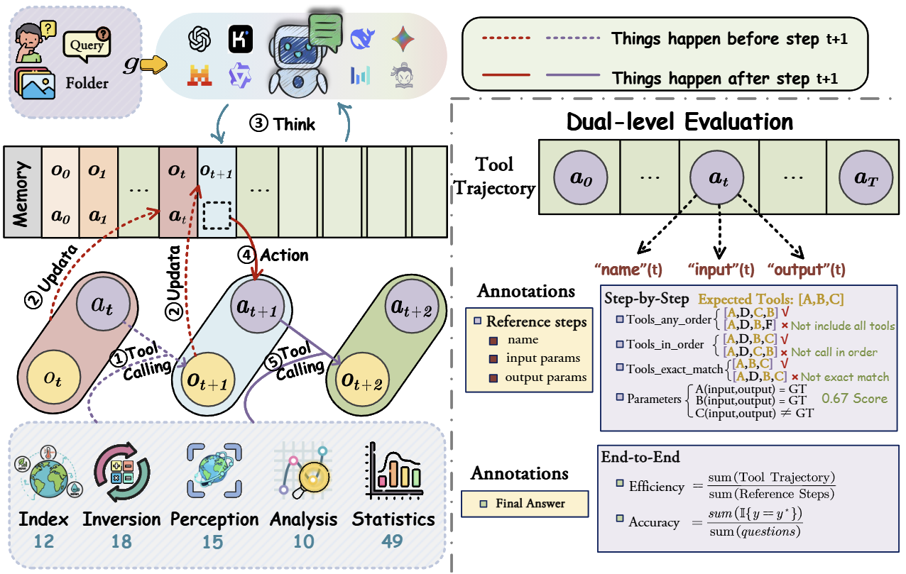
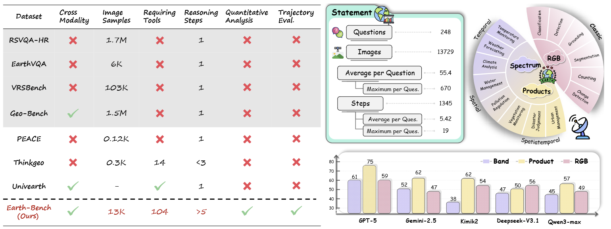

<div align="center">
<h2>  Earth-Agent: Unlocking the Full Landscape of Earth Observation with Agents
</h2> 
</div>
<div align="center">

[Peilin Feng](https://scholar.google.com/citations?user=kJRiUYwAAAAJ&hl=zh-CN)<sup>1*</sup>, 
[Zhutao Lv](https://yejy53.github.io/)<sup>1,2*</sup>,
[Junyan Ye](https://peilin-ff.github.io/)<sup>1,2</sup>, 
[Xiaolei Wang](https://scholar.google.com/citations?user=kVbzWCAAAAAJ&hl=zh-CN)<sup>2</sup>, <br>
[Xinjie Huo](https://scholar.google.com/citations?user=N-aPFvEAAAAJ&hl=zh-CN)<sup>2</sup>, 
[Jinhua Yu](https://openreview.net/profile?id=~Yize_Chen2)<sup>2</sup>, 
[Wanghan Xu](https://scholar.google.com/citations?user=LHiiL7AAAAAJ&hl=zh-CN)<sup>1</sup>, 
[Wenlong Zhang](https://openreview.net/profile?id=~wenjun_wu3)<sup>1</sup>, 
[Lei Bai](https://openreview.net/profile?id=~wenjun_wu3)<sup>1</sup>, 
[Conghui He](https://conghui.github.io/)<sup>1</sup>, 
[Weijia Li](https://liweijia.github.io/)<sup>1,2†</sup>

<sup>1</sup>Shanghai Artificial Intelligence Laboratory, <sup>2</sup>Sun Yat-sen University<br>

<div align="center">
<!-- [](https://github.com/opendatalab/FakeVLM/issues)
[](https://github.com/opendatalab/FakeVLM/stargazers) -->

[](https://arxiv.org/pdf/2503.14905) 
[](https://hits.seeyoufarm.com)
[](https://huggingface.co/datasets/lingcco/FakeClue)
</div>

</div>
This repository contains the evaluation framework for Earth Agent: Unlocking the Full Landscape of Earth Observation with Agents


## 📰 News 
- **[2025.4.15]**: 🤗 We are excited to release the FakeClue dataset. Check out [here](https://huggingface.co/datasets/lingcco/FakeClue).
- **[2025.3.20]**: 🔥 We have released **Earth-Agent: Unlocking the Full Landscape of Earth Observation with Agents**. Check out the [paper](https://arxiv.org/abs/2503.14905). We present Earth-Agent and Earth-Bench.

##  Earth-Agent Overview

<div align="center">

</div>

Earth observation (EO) is essential for understanding the evolving states of the Earth system. Although recent MLLMs have advanced EO research, they still lack the capability to tackle complex tasks that require multi-step reasoning and the use of domain-specific tools. Agent-based methods offer a promising direction, but current attempts remain in their infancy, confined to RGB perception, shallow reasoning, and lacking systematic evaluation protocols.

## 🚀 **Breakthrough Innovation**

### **First Agentic Framework for Earth Observation** 
Earth-Agent represents a **revolutionary paradigm shift** from traditional MLLMs to agentic EO analysis, unifying RGB and spectral EO data within an MCP-based tool ecosystem for the first time.

### **🔥 Key Technical Innovations**
- **🌍 Cross-Modality Integration**: First framework to seamlessly process Spectrum, Products and RGB images within a single architecture
- ** 104 Specialized Tools**: Comprehensive toolkit spanning Index, Inversion, Perception, Analysis, and Statistics - enabling everything from NDVI calculation to geophysical parameter retrieval
- **🧠 ReAct-Style Reasoning**: Advanced POMDP-based decision making that mimics how Earth scientists approach complex problems
- **📊 Dual-Level Evaluation**: Revolutionary assessment protocol that evaluates both reasoning trajectories AND final outcomes

### **💎 Unprecedented Capabilities**
- **Quantitative Spatiotemporal Analysis**: Beyond simple classification - Earth-Agent performs sophisticated temporal trend analysis, seasonality decomposition, and change point detection
- **Cross-Modal Expert Tool Invocation**: Dynamically switches between specialized tools based on data type and task requirements
- **Scalable Processing**: Handles everything from single images to datasets with hundreds of images
- **Scientific-Grade Accuracy**: Outperforms state-of-the-art MLLMs by 20-40% across classification, detection, and segmentation benchmarks

Earth-Agent establishes a **new paradigm for EO analysis**, moving the field toward scientifically grounded, next-generation applications of LLMs in Earth observation.

## 📈 **Performance Highlights**

<!-- ### **🏆 State-of-the-Art Results**
- **93.42%** accuracy on AID classification (vs 91.70% previous best)
- **96.12%** accuracy on WHU-RS19 classification (vs 95.80% previous best) 
- **60.88%** mAP on DOTA detection (vs 17.5% previous best)
- **65.60%** mAP on HRSC2016 detection (vs 25.7% previous best)
- **60.46%** accuracy on DIOR-RSVG grounding (vs 29.89% previous best) -->

### **🏆 Superior Agent Performance**
Earth-Agent significantly outperforms general-purpose agents:
- **63.33%** average accuracy vs 40.42% (GPT-Agent)
- **55.00%** with open-source models vs 26.14% (Manus)
- Consistent performance across **all three EO modalities** (Spectrum, Products, RGB)

### **🔬 Comprehensive Earth-Bench Evaluation**
- **248 expert-curated tasks** with **13,729 images**
- **Dual-level evaluation**: Both reasoning quality and final accuracy
- **Cross-modal coverage**: Spectrum, Products, and RGB data types
- **Multi-step reasoning**: Complex scientific workflows requiring tool orchestration
##  Key Contributions

- **🌟 Earth-Agent**: The first agentic framework that unifies RGB and spectral EO data within an MCP-based tool ecosystem, enabling cross-modal, multi-step, and quantitative spatiotemporal reasoning beyond pretrained MLLMs
- **📋 Earth-Bench**: A benchmark of 248 expert-curated tasks with 13,729 images, spanning spectrum, products and RGB modalities, and equipped with a dual-level evaluation protocol that assesses both reasoning trajectories and final outcomes
- **🚀 Superior Performance**: Earth-Agent substantially outperforms general agents and surpasses remote sensing MLLMs on remote sensing benchmarks, demonstrating both effectiveness and potential for advancing EO research
##  Earth-Agent Overview
<div align="center">

</div>
Earth-Agent is an agentic framework designed to tackle complex Earth observation tasks by integrating multi-modal data (RGB, spectral, and products) and leveraging a tool ecosystem for dynamic reasoning. The framework consists of several key components:

##  Earth-bench
<div align="center">

</div>


## 📦 Data Preparation

### 1. Download Dataset from Hugging Face

Download the benchmark dataset from Hugging Face:

```bash
# Install huggingface-hub if not already installed
pip install huggingface-hub

# Download the dataset
huggingface-cli download **** --local-dir ./benchmark/data --repo-type dataset
```

Alternatively, you can download manually:

```python
from huggingface_hub import snapshot_download

snapshot_download(
    repo_id="****",
    repo_type="dataset",
    local_dir="./benchmark/data"
)
```

### 2. Dataset Structure

After downloading, your data directory should have the following structure:

```
Earth_Agent/benchmark/
            └── data/
                ├── question1/
                │   ├── image1
                |   |── image2
                |   |── ...
                |   |    
                ├── question2/
                │   ├── image1
                |   |── image2
                |   |── ...
                |   |  
                ├── ...
                └── question248/
                    ├── image1
                    ├── image2
                    └── ...
```

## 🔧 Configuration

### 1. API Keys Setup

Before running evaluations, configure your model API keys in the configuration files:

```bash
# Edit the configuration files in agent/ directory
# Set your API keys for the models you want to evaluate
cp agent/config.json.example agent/config.json
# Edit agent/config.json and add your API keys
```

### 2. Model Configuration Files

The framework supports multiple models. Configuration files are located in `agent/` directory:
- `config_gpt5.json` - GPT-5 configuration
- `config_deepseek.json` - DeepSeek configuration
- `config_kimik2.json` - Kimik2 configuration
- `config_gemini2_5.json` - Gemini 2.5 configuration
- And more...

## 🚀 Running Evaluations

### 1. Single Model Evaluation

Run evaluation for a single model:

```bash
# Example: Evaluate GPT-5 model
python main.py --config agent/config_gpt5.json --mode evaluation

# Example: Evaluate DeepSeek model
python main.py --config agent/config_deepseek.json --mode evaluation
```

### 2. Batch Model Evaluation

Run evaluation for multiple models:

```bash
# Run all configured models
python batch_evaluate.py --config_dir agent/ --output_dir ./evaluate_langchain
```

## 📊 Evaluation Metrics

The framework provides comprehensive evaluation across multiple dimensions:

### 1. Tool-Use Evaluation (Step-by-Step Analysis)

Run step-by-step evaluation:

```bash
python evaluate/step_by_step.py
```

**Metrics calculated:**
- **Tool-Any-Order**: Measures if all required tools are used (order-independent)
- **Tool-In-Order**: Measures if tools are used in the correct sequence
- **Tool-Exact-Match**: Strict step-by-step matching of tool usage
- **Parameter**: Accuracy of tool parameters and arguments

### 2. End-to-End Evaluation

Run end-to-end evaluation:

```bash
python evaluate/end_to_end.py
```

**Metrics calculated:**
- **Efficiency**: Tool usage efficiency (model tools / ground truth tools)
- **Accuracy**: Final answer accuracy percentage

### 3. Evaluation Results

Results will be saved in the following locations:

```
evaluate_langchain/
├── [model_name]/
│   ├── results_summary_polished.json    # Final answers
│   ├── extracted_tool_calls.json        # Tool usage data
│   ├── step_by_step_evaluation_results.json
│   └── end_to_end_evaluation_results.json
└── ...
```

### 4. Batch Evaluation Results

Combined results for all models:

```
evaluate/
├── batch_step_by_step_results.json      # Tool-use metrics for all models
└── batch_evaluation_results.json        # End-to-end metrics for all models
```

## 📈 Understanding the Results

### Tool-Use Metrics (0.0 - 1.0 scale)
- **Higher is better** for all tool-use metrics
- **Tool-Any-Order**: 1.0 means all required tools were used
- **Tool-In-Order**: 1.0 means perfect sequential tool usage
- **Tool-Exact-Match**: 1.0 means perfect step-by-step execution
- **Parameter**: 1.0 means perfect parameter accuracy

### End-to-End Metrics
- **Efficiency**: Lower values indicate more efficient tool usage
  - 1.0 = Perfect efficiency (same number of tools as ground truth)
  - \>1.0 = Used more tools than necessary
  - <1.0 = Used fewer tools than ground truth
- **Accuracy**: Percentage of correctly answered questions (0-100%)

### Sample Output

```
====================================================================================================
Model Name                Tool_Any_Order  Tool_In_Order   Tool_Exact_Match   Parameter
----------------------------------------------------------------------------------------------------
deepseek-V3_1_IF          0.8921          0.8764          0.7405             0.5722
gpt5_AP                   0.7661          0.7504          0.5960             0.4615
kimik2_IF                 0.8062          0.7990          0.6332             0.5219
...
====================================================================================================

======================================================================
Model Name                     Efficiency   Accuracy
----------------------------------------------------------------------
gpt5_AP                        1.5312      59.32%
kimik2_IF                      1.4104      62.71%
deepseek-V3_1_AP               1.6895      55.93%
...
======================================================================
```

## 🔍 Advanced Usage

### Custom Evaluation Range

Modify the evaluation range by editing the slice in evaluation files:

```python
# In evaluate/step_by_step.py and evaluate/end_to_end.py
# Evaluate RGB Modality
for question_index, gt_item in list(gt_dict.items())[188:]:

# Evaluate Spectrum Modality
for question_index, gt_item in list(gt_dict.items())[0:100]:

# Evaluate Products Modality
for question_index, gt_item in list(gt_dict.items())[100:188]:
```

### Ground Truth Data

The ground truth file `extracted_tool_calls_GT.json` contains reference tool usage patterns and correct answers for comparison.

## 📝 File Descriptions

- `main.py` - Main evaluation script for single models
- `evaluate/step_by_step.py` - Tool-use evaluation metrics
- `evaluate/end_to_end.py` - End-to-end evaluation metrics
- `evaluate/merge.py` - Tool call merging utilities
- `agent/` - Model configuration files
- `benchmark/` - Benchmark dataset and questions
- `tools/` - Tool implementations for the agent system
